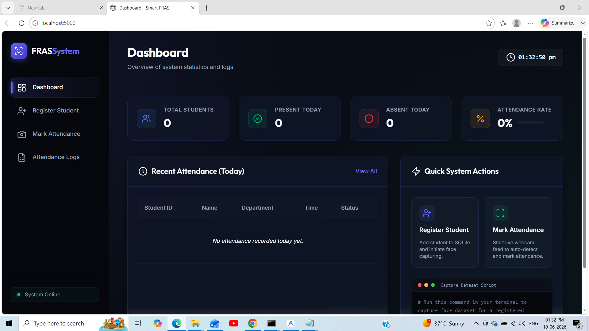
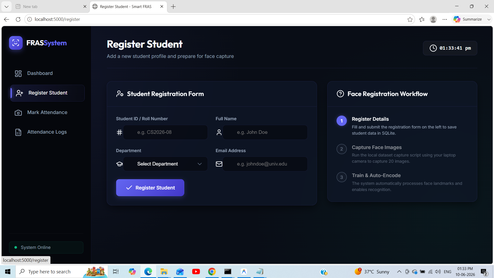
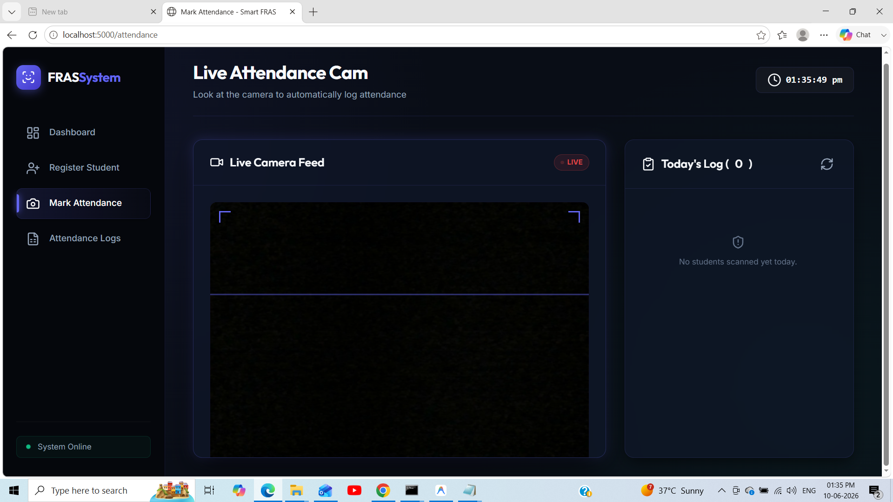
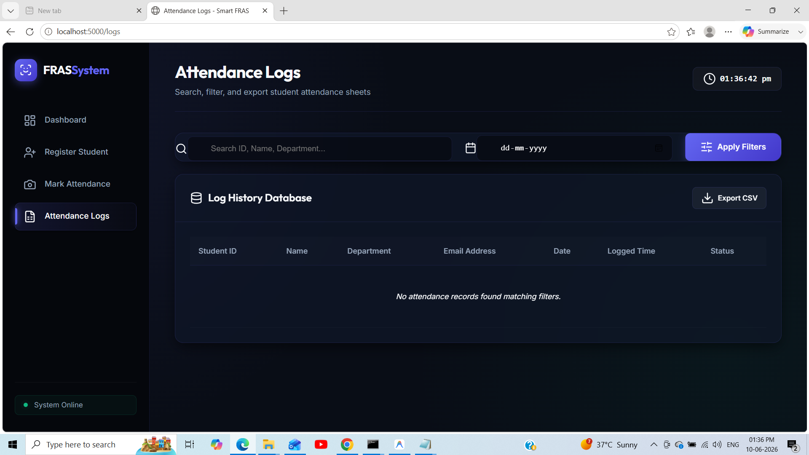

# 🎓 Smart Face Recognition Attendance System

## 📖 Project Overview

The **Smart Face Recognition Attendance System** is a web-based application developed to automate the attendance marking process using facial recognition technology.

Traditional attendance systems require manual effort and are prone to errors and proxy attendance. This project utilizes **Computer Vision**, **Machine Learning**, and **Web Development** technologies to automatically identify registered individuals and record their attendance in real time.

This project was developed as an academic project to demonstrate the practical implementation of Artificial Intelligence and Face Recognition in attendance management systems.

---

## 🎯 Objectives

* Automate attendance marking using facial recognition.
* Reduce manual effort in attendance management.
* Prevent proxy attendance.
* Provide a user-friendly web interface.
* Explore real-world applications of Artificial Intelligence and Computer Vision.

---

## ✨ Features

* 📸 Face Registration and Dataset Collection
* 🧠 Face Encoding Generation
* 👤 Real-Time Face Recognition
* 📋 Automatic Attendance Recording
* 🌐 Flask-Based Web Dashboard
* 💾 Database Integration
* ⚡ Fast and Accurate Recognition

---

## 🛠️ Technologies Used

### Programming Language

* Python 3.11

### Framework

* Flask

### Libraries

* OpenCV
* dlib
* face_recognition
* NumPy
* Pillow

### Database

* SQLite

### Frontend

* HTML
* CSS
* JavaScript
* Bootstrap

---

## 🏗️ System Workflow

```text
User Registration
        │
        ▼
Dataset Collection
        │
        ▼
Face Encoding Generation
        │
        ▼
Stored Encodings
        │
        ▼
Real-Time Recognition
        │
        ▼
Attendance Recording
        │
        ▼
Dashboard Display
```

---

## 📂 Project Structure

```text
Face-Recognition-Attendance-System/
│
├── app.py
├── capture_dataset.py
├── encoder.py
├── database.py
│
├── static/
│
├── templates/
│
├── README.md
├── requirements.txt
├── LICENSE
└── .gitignore
```

---

## 🚀 Installation

### 1. Clone the Repository

```bash
git clone https://github.com/hansy3345/face-recognition-attendance-system.git
cd face-recognition-attendance-system
```

### 2. Install Dependencies

```bash
pip install -r requirements.txt
```

### 3. Capture Face Dataset

```bash
python capture_dataset.py
```

### 4. Generate Face Encodings

```bash
python encoder.py
```

### 5. Run the Application

```bash
python app.py
```

### 6. Open the Browser

```text
http://localhost:5000
```

---

## 💻 Usage

### Register New Users

1. Capture facial images using the dataset collection module.
2. Store images in the dataset folder.

### Generate Encodings

Run:

```bash
python encoder.py
```

This generates facial encodings used for recognition.

### Start Attendance System

Run:

```bash
python app.py
```

Open:

```text
http://localhost:5000
```

The system will recognize registered users and automatically record attendance.

---

## 🎓 Learning Outcomes

Through this project, the following concepts were explored:

* Computer Vision
* Face Detection and Recognition
* Machine Learning Applications
* Flask Web Development
* Database Management
* Python Software Development
* Real-Time System Integration

---

## 🔮 Future Enhancements

* Multi-Face Recognition Support
* Cloud Database Integration
* Attendance Analytics Dashboard
* Mobile Application Support
* Email Notifications
* Anti-Spoofing Face Detection
* Admin Authentication System

---
## 📸Screenshots

### Dashboard



### Register student page



### Mark Attendance Page



### Attendance logs page



## 📊 Project Status

✅ Completed

✅ Successfully Tested

✅ Real-Time Face Recognition Working

✅ Attendance Recording Functional

---

## 👩‍💻 Author

**HAMSIKA PITCHUKALA**

GitHub: https://github.com/hansy3345

Email: [hansy547@gmail.com](mailto:hansy547@gmail.com)

---

## 🙏 Acknowledgements

Special thanks to the developers and maintainers of:

* OpenCV
* Flask
* dlib
* face_recognition

for providing powerful open-source tools that made this project possible.

---

## 📜 License

This project is licensed under the MIT License.

See the LICENSE file for more information.
